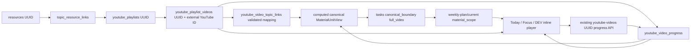

# Video integration audit — KPSS Koçu

Tarih: 2026-10-05. Kapsam: repository source audit ve LOCAL/DEV minimum wiring. Production deploy, production SQL ve production veri mutasyonu yapılmadı. Aşağıdaki schema, repository migration'larının tanımladığı modeldir; canlı production veritabanı envanteri veya production veri yeterliliği iddiası değildir.

**Karar: mevcut backend contract, senkronize edilmiş ve canonical göreve bağlanmış tam videoyu oynatmak ve ilerlemesini kaydetmek için yeterli. Yeni schema/migration veya ikinci video tracking sistemi gerekmiyor.** Eksik katalog, doğrulanmış konu eşlemesi veya canonical task varsa UI bunları uyduramaz.

**Güncel doğrulama — 2026-10-05: LOCAL VIDEO ACCEPTANCE GREEN / NOT DEPLOYED.** User-authorized recovery local CLI/Edge ES256 uyumsuzluğunu ve eski PostgREST JWT clock-cache hatasını uyumlu runtime patch'leriyle giderdi; JWT verification ve auth/DB kuralları korunuyor. Dedicated current-week fixture existing resource/catalog/validated mapping/canonical adapter/task/progress/session tablolarını kullanır. Gerçek product root'ta playback, checkpoint, refresh/resume, Today→Focus, session lifecycle/finish ve controlled missing resource mapping PASS. Tek progress kaydı 365 sn; tek session completed 15 dk, task partially completed. Frontend SDK readiness/resume yarışları düzeltildi. Regression 1509/1509 (200 dosya), 60/60 fresh-token local API reads PASS. [Güncel kabul raporu](VIDEO_LOCAL_AUTHENTICATED_ACCEPTANCE.md) ve [kanıtlar](ux-lab-evidence/frontend-migration/README.md) aşağıdaki eski pending/blocker durumlarını supersede eder. Audit'teki veri modeli/source contract bulguları geçerlidir; yeni schema veya production işlem yok.

## Veri zinciri



Canonical material ayrı bir video kopyası veya yeni tablo değildir. `loadCanonicalMaterialUnits` mevcut resource, playlist catalog, video-topic mapping ve progress kayıtlarını `MaterialUnitView` olarak projekte eder.

## 1. Bir YouTube URL bugün nereden giriliyor?

Web Kaynaklar ekranında YouTube URL/playlist ekleme formu yok. Repository'deki mevcut giriş `scripts/provision-youtube-material.mjs` ve onun kullandığı authenticated **PUT `/topics/:topicId/material-links`** endpointidir. Girdi `resourceId`, `isPrimary`, `playlist: { sourceUrl, youtubePlaylistId }` içerir. CLI varsayılan olarak dry-run çalışır; `--apply` mevcut link endpointini, ardından **POST `/youtube-playlists/:internalPlaylistUuid/sync`** ve doğrulama için kaynak video listesi GET'ini çağırır. Bu audit sırasında provisioning çalıştırılmadı.

Endpoint kaynağın kullanıcı/profile sahipliğini ve konu ile ders uyumunu doğrular. `normalizeTopicResourceLinkInput` yalnızca YouTube hostlarını ve http/https protokolünü kabul eder; dış playlist ID'sini ayrı alır. **URL'deki `list=` parametresini ayrıştırıp verilen ID ile karşılaştırmaz.** Bu, ileride kaynak ekleme formu yapılırken kapatılması gereken mevcut bir giriş doğrulama boşluğudur; player `sourceUrl` kullanmaz.

Tek başına watch URL'sinden canonical video oluşturma endpointi bulunmadı. Mevcut desteklenen yol playlist link → resmi YouTube Data API katalog sync → doğrulanmış video-topic mapping yoludur.

Kaynaklar: `scripts/provision-youtube-material.mjs`, `docs/youtube-material-provisioning.md`, `supabase/functions/_shared/topic-resource-link.ts`, `supabase/functions/app-api/index.ts` (`topicMaterialLinksMatch`).

## 2. URL, video_id ve playlist_id nerede tutuluyor?

| Alan | Anlam / authority |
| --- | --- |
| `resources.id` | Kullanıcıya ait gerçek kaynak UUID'si |
| `youtube_playlists.id` | İç playlist UUID'si |
| `youtube_playlists.source_url` | Kullanıcının verdiği kaynak URL; embed veya task identity değildir |
| `youtube_playlists.youtube_playlist_id` | Dış YouTube `list=` ID'si |
| `topic_resource_links.youtube_playlist_id` | **İç** `youtube_playlists.id` FK'si; aynı alan adı dış ID anlamına gelmez |
| `youtube_playlist_videos.id` | İç katalog video UUID'si; canonical task ve progress identity |
| `youtube_playlist_videos.youtube_playlist_id` | İç playlist UUID FK'si |
| `youtube_playlist_videos.youtube_video_id` | Dış YouTube video ID'si; resmi iframe API'ye verilen playback ID |
| `youtube_video_topic_links.youtube_playlist_video_id` | İç katalog video UUID FK'si |
| `youtube_video_progress.youtube_playlist_video_id` | İç katalog video UUID FK'si |

`sync_youtube_playlist_catalog` `(youtube_playlist_id, youtube_video_id)` unique anahtarıyla upsert eder; aynı video katalog UUID'sini korur. Eski öğeleri inactive yapar; yeniden görünen öğeleri reaktive eder. Progress katalog sync sırasında silinmez. Tablolar owner/profile foreign key ve RLS kullanır.

Kaynaklar: `supabase/migrations/20260820113000_create_topic_resource_links.sql`, `20260820120000_youtube_playlist_sync.sql`, `20260820123000_youtube_video_progress.sql`.

## 3. Bir canonical çalışma hangi videoyla nasıl eşleşiyor?

`topic_resource_links` kaynak–konu–playlist ilişkisini sağlar; playlist içindeki her videonun aynı konuya ait olduğunu kanıtlamaz. Bireysel konu eşlemesinin authority'si **`youtube_video_topic_links`** tablosudur: `mapping_status`, `mapping_provenance`, `curriculum_node_id`, opsiyonel segment sınırları ve `is_active`.

`canonical-material-loader.ts` bağlı playlistlerin aktif katalog videolarını, bu videoların mevcut ilerlemesini ve video-topic mapping'lerini yükler. `material-db-adapter.ts` → `material-unit-view.ts` canonical görünümü üretir. Video görünümünün `sourceId` değeri katalog UUID'sidir; görünüm kimliği `youtube:<catalogUuid>:mapping:<mappingUuid>` biçimindedir. Mapping yoksa missing, birden çok çelişkili tam-video mapping varsa ambiguous kalır. Başlık benzerliği veya playlist sırası mapping yerine geçmez.

Planner eligibility için aktif, validated, ders/konu uyumlu ve authoritative provenance (`reviewed_mapping`, `trusted_import`, `corrected`) gerekir. `ai_candidate` yeterli değildir. Segment mapping desteklenir; fakat segment progress authority olmadığı için segment canonical workload'u exact sayılmaz (`segment_progress_unavailable`). Bu çalışma yalnızca mevcut **full_video** yolunu bağlar.

Canonical Planner V2 `workloadIdentity = youtube:<catalogUuid>` ve `boundary = {kind: "full_video", videoId: <catalogUuid>, durationSeconds, watchedSeconds}` üretir. Mevcut confirm/apply lifecycle bunu `tasks.canonical_workload_identity`, `canonical_material_view_id`, `canonical_boundary`, `resource_id`, `curriculum_node_id` alanlarına persist eder. Bu audit gate açmaz, planner apply çalıştırmaz ve mevcut görevlere sahte boundary yazmaz.

Kaynaklar: `supabase/migrations/20260824123500_mat001_material_progress_and_video_topic_mapping.sql`, `20260826120000_planner_v2_proposal_lifecycle_candidate.sql`, `20260902103000_harden_planner_v2_expired_confirmation_state.sql`; `supabase/functions/_shared/canonical-material-loader.ts`, `canonical-planner-v2-readonly.ts` (`workloadIdentity`, `materialBoundary`); `packages/domain/src/planning/material-db-adapter.ts`, `material-unit-view.ts`, `material-remaining-scope.ts`, `canonical-workload.ts`; `packages/domain/src/planning-v2/proposal-lifecycle.ts`.

## 4. Today mevcut task'tan doğru videoyu hangi contract ile resolve eder?

**GET `/weekly-plan/current`** `planWithTasks` üzerinden task için `material_resource_id` ve `material_scope` projeksiyonu verir. `_shared/task-material-scope.ts` exact full-video boundary'yi mevcut katalog ve progress ile karşılaştırır. Video yoksa veya süre uyuşmazsa exact kapsam yerine resource kapsamına düşer.

Frontend contract: `apps/web/src/lib/roadmap.ts` içindeki `RoadmapTask` / `TaskMaterialScope`:

```ts
material_scope: {
  kind: "full_video";
  resourceId: string; // resources.id
  youtubePlaylistVideoId: string; // youtube_playlist_videos.id, YouTube ID değil
  title: string;
  position: number; // katalogda 0-based
  durationSeconds: number;
  watchedSeconds: number;
  completed: boolean;
}
```

Player, **GET `/resources/:resourceId/youtube-videos`** sonucunda bu iç video UUID'sini aynı resource kütüphanesinde bulur. Bulunan `VideoItem.youtubeVideoId` dış playback ID'sidir. Ardından **GET `/youtube-videos/:catalogUuid/progress`** ile fresh resume position alınır. Raw URL, task title, sıra numarası veya canonical identity metnini ayrıştırmak gerekmez.

Önemli mevcut boşluk: **GET `/tasks/next`**, `pilot.ts` içindeki daha dar task projection'ını döndürür; `material_scope` içermez. Today önerilen task'ın **aynı UUID ile `/weekly-plan/current` içindeki hydrated kaydını** kullanmalıdır. Önerinin seçim/reason/minute authority'si korunur. Öneri kaydı weekly projection'da yoksa UI exact video uyduramaz. Minimum wiring bu ID join'ini düzeltir.

`planWithTasks` video lookup'ı sahipliği RLS'ye bırakır; resource-playlist üyeliğini ve active durumunu player listesi üzerinden ayrıca doğrulamak gerekir. Bu nedenle exact video listede yokken ilk videoya geçiş yapılmamalıdır.

Kaynaklar: `supabase/functions/app-api/index.ts` (`planWithTasks`, `nextTask`, `resourceYoutubeVideosMatch`, `youtubeVideoProgressMatch`); `supabase/functions/_shared/pilot.ts` (`loadDailyCoachContext`); `apps/web/src/lib/today-focus.ts`, `today-material-actions.ts`; `apps/web/src/components/StudyTodayPanel.tsx`, `StudyMaterialWorkspace.tsx`, `VideoPlayerDrawer.tsx`.

## 5. Playlist progress ve current-video progress nerede tutuluyor?

Tek persist edilen video tracking authority **`youtube_video_progress`** tablosudur. PK `(user_id, youtube_playlist_video_id)`; alanlar `exam_profile_id`, `last_position_seconds`, `watched_seconds`, `completed_at` ve timestamp'lerdir. `last_position_seconds` resume noktasıdır; `watched_seconds` gerçekten sayılan izleme süresidir. Seek ile birbirlerinin yerine kullanılmaz.

**PUT `/youtube-videos/:catalogUuid/progress`** `{lastPositionSeconds, watchedSeconds}` gönderir ve mevcut **`record_youtube_video_progress`** RPC'sini çağırır. RPC owned active katalog kaydını ve pozitif süreyi kontrol eder, değerleri video süresine sınırlar, watched değerini monoton korur; tamamlanma eşiği `ceil(durationSeconds * 0.95)`, `completed_at` kalıcıdır. GET/PUT çıktısı `YouTubeVideoProgressView` / UI `VideoProgress` contract'ıdır.

**Ayrı playlist progress tablosu veya persist edilmiş playlist current-video pointer yok.** Kaynak/playlist toplamları katalogdaki mevcut item progress'lerinden türetilir. `summarizeResourceVideoProgress` completed count ve duration-weighted watched percent üretir. Resource browser'ın ilk tamamlanmamış öğeyi seçmesi bir UI resume politikasıdır; canonical task-video mapping değildir. Current-video seçimi component state, resume konumu ise gerçek progress tablosudur.

`EmbeddedYouTubePlayer` resmi iframe API'nin doğal playback delta'sını mevcut `countedYouTubeWatchDelta` ile sayar; 15 saniyelik checkpoint, pause/end/visibility/pagehide/unmount üzerinden aynı API'ye yazar. İzlenmiş benzersiz zaman aralıklarının ayrı bir coverage modeli yoktur. Video checkpoint'i ile study-session finish tek transaction değildir; sekme kapanmasında son async checkpoint'in teslimi garantili değildir. Minimum wiring mevcut semantics'i değiştirmez.

Kaynaklar: progress migration/RPC; `supabase/functions/_shared/youtube-video-progress.ts`; `apps/web/src/lib/youtube-player-progress.ts`, `resource-material-progress.ts`; `VideoPlayerDrawer.tsx`, `ResourceDetailDrawer.tsx`.

Mevcut `task_progress` / study-session dakika muhasebesi video progress değildir. Video %95'e ulaştığında player görev status'unu veya oturum bitişini yazmaz. Resource workload projeksiyonu (`_shared/material-workload.ts`, `loadMaterialWorkloads`) yine aynı video progress tablosunu okur; `completed_at` olan videoyu workload hesabında tüm süresi karşılanmış sayar. UI'nin watched yüzdesi gerçek watched seconds üzerinden kalabilir. Telegram materyal özeti de aynı katalog/progress truth'unu okur (`telegram-material-summary.ts`). Bu projeksiyonlar yeni tracking tabloları değildir ve bu görevde semantics'leri değiştirilmedi.

## Mevcut endpointler ve TypeScript sınırları

| Endpoint | Mevcut işlem / contract |
| --- | --- |
| GET/PUT `/topics/:topicUuid/material-links` | Kaynak–konu–playlist bağlantısı; `TopicResourceLinkInput` |
| POST `/youtube-playlists/:internalPlaylistUuid/sync` | Resmi YouTube Data API ile owned catalog sync; Edge `YOUTUBE_API_KEY` gerekir |
| GET `/resources/:resourceUuid/youtube-videos` | Owned resource, linked playlist metadata, active video catalog ve item progress; `ResourceVideoLibraryResponse` / `PlaylistItem` / `VideoItem` |
| GET/PUT `/youtube-videos/:internalVideoUuid/progress` | Fresh resume ve mevcut progress RPC; `YouTubeVideoProgressInput` / `YouTubeVideoProgressView` |
| GET `/weekly-plan/current` | Canonical task boundary'nin `material_scope` projeksiyonu |
| GET `/tasks/next` | Task seçim authority'si; video scope için weekly projection ile task UUID join gerekir |

## 6. Eksik gerçek entegrasyon parçaları

1. Web'de resource URL ekleme/sync formu yok; provisioning yolu mevcut. URL–external playlist ID tutarlılık kontrolü eksik. Bunlar oynatılabilir catalog zaten varsa inline player için önkoşul değildir.
2. Video-topic mapping için web review/validation akışı bulunmadı. Deterministic title candidate script'i bir aday raporudur; canonical mapping authority değildir. Veri yeterliliği kullanıcıya ait gerçek katalog/mapping/task kayıtlarına bağlıdır.
3. `/tasks/next` ile hydrated weekly task arasındaki projection kaybı; ID join eksik.
4. Resource-only görevde otomatik ilk-video fallback, exact görev içinden başka videoya geçiş ve progress GET hatasında player açılması güvenilir task-player bağlantısını bozuyor.
5. Dış playback ID'sinin URL yerine ID olduğuna, resource üyeliğine ve GET/PUT response identity/duration tutarlılığına player sınırında açık doğrulama eksik.
6. Today task summary, inline checkpoint yanıtıyla canlı güncellenmiyor; iframe progress ve kapsam başlığı ayrışabiliyor. Başlık sırası bazı yüzeylerde 0-based değeri kullanıcıya doğrudan gösteriyor.
7. Local Supabase/Auth hizmeti bu ortamda çalışmıyor. Authenticated local catalog → task → playback → refresh/resume smoke henüz gerçekleştirilemez. Production'a bağlanarak bu boşluk kapatılmayacak.

## 7. UX Lab inline player için minimum LOCAL/DEV wiring

Örnek `CoachVideo` ve `coach-workspace-state` simulation progress'i gerçek progress'e çevrilmemeli; buradaki `resourceId`, video sırası ve örnek task kimlikleri gerçek UUID değildir. Mevcut gerçek inline surface **`StudyMaterialWorkspace` + `VideoPlayerPanel`** yeniden kullanılmalı.

Minimum uygulama:

1. Existing task projection ile source library arasında pure ID resolver ekle; `resourceId`, katalog UUID ve duration uyuşmazlığı/missing durumunda video açma. External playback ID için URL kabul etme. Exact scope yoksa kullanıcının library'den açık seçimini iste; canonical task'a atama yapma.
2. Exact görev player'ını o video ile sınırla; resource browsing ayrı kaynak yüzeyinde devam eder.
3. Progress GET başarılı ve identity doğrulanmış olmadan SDK/player oluşturma. Hata durumunda retry sun; network failure'ı sıfır progress gibi kullanma. PUT yanıtını da aynı item için doğrula.
4. Today önerisini task UUID ile hydrated weekly contract'a bağla. Mevcut progress yanıtını yalnızca eşleşen task'ın gösterilen kapsamına uygula; yeni persist edilmiş state/tracking ekleme.
5. UX Lab için ayrı **DEV-only `/ux-lab/live-video`** inceleme girişi ekle: loopback frontend + loopback Supabase şartı auth/API importlarından önce kontrol edilir; owned weekly task listesini ve aynı inline player'ı kullanır. Bu yüzey planner/session yaratmaz, yalnızca mevcut video progress endpointini kullanır. Fixture Lab ayrı ve ağsız kalır. Production build'de DEV entry çıkarılır.
6. Resolver, öneri hydration, identity/read failure sınırı ve DEV loopback gate için davranış testleri; web typecheck/build ve Lab izolasyon kontrolü.

Yeni URL, örnek YouTube videosu, arbitrary iframe `src`, raw URL task identity, yeni progress tablosu veya migration eklenmeyecek. Mapping/provisioning eksikliği yeni schema gerektirmez; mevcut contract ile veri hazırlama gerektirir. Segment coverage ve kalıcı playlist selection gibi kapsam dışı yeni ürün davranışları bu görevde uygulanmaz.

## Uygulama ve doğrulama durumu

Audit minimum wiring'den **önce** yazıldı; yukarıdaki eksik parçalar audit başlangıcındaki bulgulardır. 3–6 numaralı frontend bağlantı boşlukları aşağıdaki kaynak değişiklikleriyle kapatıldı. URL ekleme/sync ve mapping review ürün akışları bu minimum wiring'in dışında kaldı.

### Uygulanan değişiklikler

- `apps/web/src/lib/task-video.ts`: internal catalog UUID, actual resource library membership, native external video ID ve duration üzerinden resolver; GET/PUT progress identity ve bound doğrulaması. Bu adapter endpoint contract'larını yeniden kullanır; persist etmez.
- `apps/web/src/lib/today-focus.ts` + `components/StudyTodayPanel.tsx`: `/tasks/next` seçimi aynı task UUID ile weekly hydrated contract'a join edilir. Progress cevabı yalnızca aynı katalog video kimliği/süresi olan task scope sunumunu günceller; task status/session muhasebesine dokunmaz.
- `components/VideoPlayerDrawer.tsx`: task exact video kilidi, resource-only task için açık seçim, failed GET durumunda player oluşturmama, retry, response doğrulaması ve fresh GET/checkpoint'ten library sunumu. Mevcut resmi iframe API, GET/PUT endpoint ve checkpoint sayımı korunur.
- `components/StudyMaterialWorkspace.tsx` ve `ResourceDetailDrawer.tsx`: task scope aynı player'a aktarılır. Video başlıklarında katalogdaki 0-based position kullanıcıya `position + 1` olarak gösterilir.
- `main.tsx`, `dev-video-entry.tsx`, `dev-video-review.tsx`, `lib/local-video-review.ts`: DEV-only canlı inceleme girişi. Frontend origin ve Supabase endpointinin loopback olması auth/API importundan önce zorunlu. Bu ekran yalnızca owned weekly full-video task'larını okur; planner/session oluşturmaz. Lab'deki `CoachVideo` bu ayrı inceleme ekranına link verir; fixture state/progress ağsız kalır.

**Yerel inceleme:** [UX Lab gerçek video](http://127.0.0.1:5174/ux-lab/live-video). Yerel hesaba giriş sonrası haftalık plandaki gerçek full-video task seçilir. Paylaşılabilir seçim URL'sindeki `task` parametresi mevcut task UUID'sidir; video URL'si değildir. Aynı canonical task gerçek Today/Focus yüzeyinde de aynı player contract'ıyla açılır.

### Doğrulama

- İlk ilgili kontrol: 10 test dosyası / 68 test PASS.
- Tüm non-integration regression paketi: **199 dosya / 1494 test PASS**; kanıt: `ux-lab-evidence/frontend-migration/video-integration-regression-results.json`.
- Web TypeScript build/typecheck PASS; Vite local distribution build PASS. Derleme deploy değildir.
- Distribution asset taramasında DEV review girişinin route/text/module işaretleri yok: **0 eşleşme**. Lab fixture izolasyonu (19 dosya), canonical Planner V2 read-only, Planning V2 shadow, AI Coach ve Coach preview safety kontrolleri PASS.
- Yerel browser'da `/ux-lab/live-video` açıldı: doğru yerel giriş gereksinimi gösteriliyor, console error yok. Ekran kanıtı: `ux-lab-evidence/frontend-migration/video-integration-local-auth.png`. Loopback port kontrolünde Supabase/Auth `127.0.0.1:54321` kapalı; Docker komutu ve standart Docker executable mevcut değil. Hiçbir production endpointine fallback yapılmadı.
- **Authenticated playback → checkpoint → refresh/resume E2E doğrulanmadı.** Bunun için çalışan yerel Supabase/Edge, yerel auth hesabı ve mevcut synced catalog + validated video-topic mapping + canonical full-video task gerekiyor. Bu audit sahte auth, katalog/video URL veya task boundary üretmedi; provisioning/mapping/apply mutasyonu çalıştırmadı.

Bu görevde backend endpoint, SQL, migration, env, planner gate veya deploy ayarı değiştirilmedi. Önceki frontend migration çalışmasından repository'de bulunan değişiklikler korundu.

Audit yazıldığı andaki tarihsel durum: **SOURCE_AUDITED / LOCAL_WIRING_IMPLEMENTED / LOCAL_AUTH_SMOKE_PENDING / NOT_DEPLOYED**. Güncel recovery durumu üstteki GREEN bölümüdür.

Recovery öncesindeki authenticated denemede Docker/Supabase/Auth/DB hazır ve sign-in başarılıydı, fakat local Edge ES256 verifier 401 üretiyor; katalogda 0 native playback ID ve güncel haftada 0 canonical video task vardı. Bu tarihsel blocker [VIDEO_LOCAL_AUTHENTICATED_ACCEPTANCE.md](VIDEO_LOCAL_AUTHENTICATED_ACCEPTANCE.md) içindeki 2026-10-05 recovery ile çözüldü. Gerçek local video zinciri artık GREEN; production **NOT DEPLOYED**.
